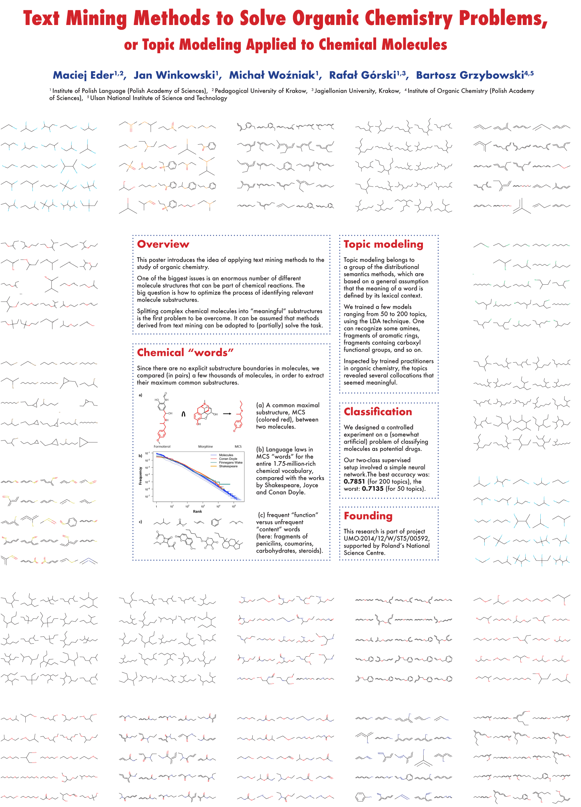
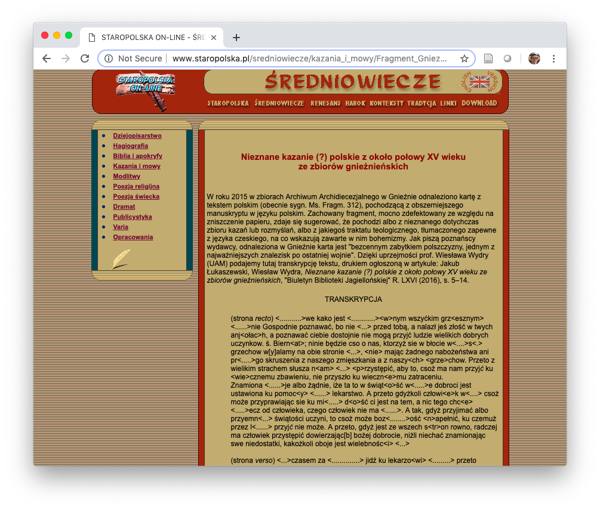
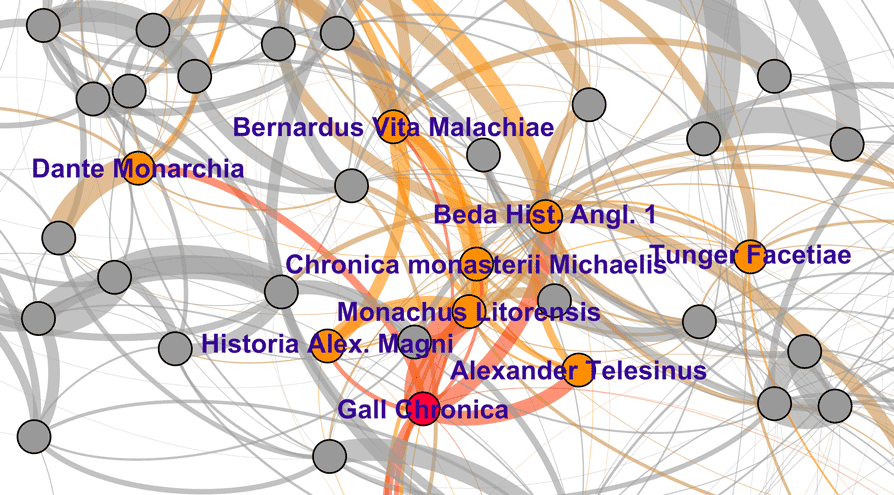
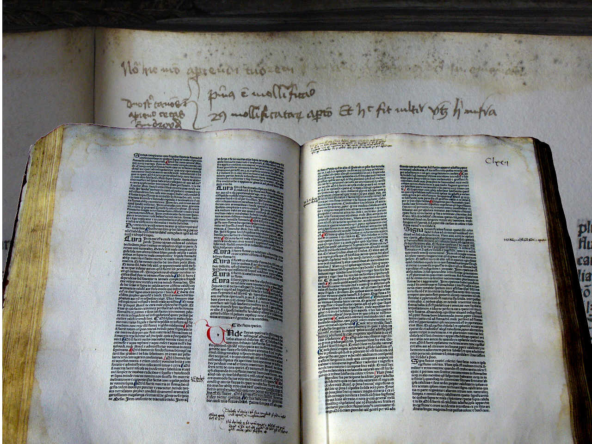

## { .white }

Doskonałość naukowa w humanistyce:   filologia w zmieniającym się świecie

 Maciej Eder

<!-- 
Instytut Języka Polskiego PAN
 -->

<!-- 
 UP Kraków, 11 IV 2019 
 -->

---

## Instytut Języka Polskiego PAN

* Słownik staropolski
* Wielki Słownik Języka Polskiego
* Słownik polszczyzny XVII i XVIII wieku
* Słownik łaciny średniowiecznej w Polsce
* Słownik gwar polskich
* Słownik gwar Mazur i Ostródzkiego
* Słownik staropolskich nazw osobowych
* Słownik pojęciowy języka staropolskiego
* Ogólnosłowiański Atlas Językowy
* Atlas Języków Europy

---

## 

<h2 class="shout">0 punktów</h2>

---

## SXVII: ofiara własnego sukcesu (?)

---

## WSJP: kamień młyński u szyi IJP PAN (?)

---

## 

<h2 class="shout">85%</h2>

---

## doskonałość naukowa: Cambridge

The mission of the University of Cambridge is to contribute to society through the pursuit of education, learning and research at the highest international levels of excellence.

---

## Doskonałość naukowa: ERC

* High risk / high gain
* vs. incremental knowledge

---

## przeszkody na drodze do doskonałości

1. niedostateczna komunikacja (brak synergii)
2. niewielki kontekst międzynarodowy, mała mobilność
3. zamknięcie się w ciasno zdefiniowanych dyscyplinach
4. parametryzacyjny gorset
5. niedostateczna aktywność grantowa

---

## synergia

* komunikacja między zespołami badawczymi
    * czym się zajmują koledzy z sąsiedniej katedry?
* reguła kanapy i ekspresu do kawy
    * zespół jest efektywny, gdy się spotyka
* inicjatywy w Instytucie Języka Polskiego PAN
    * Lunch z Humanistyką Cyfrową
    * Hortus Deliciarum
    * Dialogi Staropolskie
    * Spotkania z Gwarą

---

## kontekst międzynarodowy

* oczywiste założenia bywają błędne
    * gdzie jest najlepsza polonistyka na świecie?
    * wiadomo: gdzieś w Polsce
    * po cóż zatem szukać inspiracji za granicą?
* ale: jak to się ma do innych filologii narodowych?
    * por. wydziały portugalistyki w Portugalii
    * por. wydziały hungarystyki na Węgrzech
    * etc. etc.

---

## kontekst międzynarodowy

* filologia narodowa nie może być usprawiedliwieniem
* w naukach o zasięgu lokalnym też obowiązuje najwyższa jakość badań!

---

## umiędzynarodowienie w IJP PAN

* granty o zasięgu międzynarodowym
    * COST Action _Distant Reading_
    * COST Action _eLexicography_
    * COST Action _Medioevo Europeo_
    * _Deep Learning in Computational Stylistics_

* visiting fellows na stażach różnej długości
    * Yale University (Fulbright)
    * University of Alberta (National Research Council, Canada)
    * Universidad de Sevilla (Erasmus+)
    * Universität Würzburg (COST Action)
    * Università di Padova (COST Action)
    * . . .  

---

## umiędzynarodowienie przez grupy badawcze

---

## parametryzacja

* buchalteryjne podejście do parametrii zabija ducha nauki
* potrzebna jest odwaga publikowania poza punktacją
    * _Słownik polszczyzny XVII wieku_
    * Renaissance Quarterly
    * Mississippi Quarterly
    * Frontiers in Digital Humanities
    * . . . 

---

## interdyscyplinarność

* interdyscyplinarność nie może oznaczać a-dyscyplinarności!
* złudzenie, że można osiągnąć doskonałość w kilku dyscyplinach
* rzeczywista interdyscyplinarność: współpraca specjalistów z różnych dyscyplin

---

## {.cover}

---

## wartość: 40 pkt. (= 140 nowych pkt.)

<!-- 

---

## aktywność grantowa

* 

-->

---

## Pascal: dwie nieskończoności

* Podróż w wyobraźni do końca (?) świata
* Podróż w wyobraźni do wnętrza ciała
* I nigdzie nie ma granicy

---

## rewolucja naukowa

---

## rewolucja w humanistyce

* Nowe narzędzia: komputer & internet
* Nowe zasoby: miliony książek
* Nowe metody: data mining, machine learning
* Nowe dyscypliny: Digital Humanities

---

## korpus tekstów staropolskich

---

## kim był Gall Anonim?

* teza o podobnieństwie stylistycznym _Kroniki_ Galla i _Translacji świętego Mikołaja_ Mnicha z Lido

---

## Gallus Anonymous vs. Italus Anonymus

---

## rekonstrukcja biblioteki Kopernika

---

## miary korpusowe w chemii organicznej

---

## humanistyka w dzisiejszym świecie

* postprawda i fake news
* detekcja populizmu
* smart cities
* chatboty
* niebezpieczeństwa AI
* . . .

---

## przyszłość już nadeszła

* mamy szansę na przeprowadzenie badań w niespotykanej skali
* przed nami odpowiedzialność za dygitalizację dorobku ludzkości
* przed nami szansa na szukanie dwóch nieskończoności...

---

## dziekuję za uwagę!

[\@MaciejEder](https://twitter.com/MaciejEder)

maciej.eder@ijp.pan.pl

[http://maciejeder.org](http://maciejeder.org/pl)

###############

 
