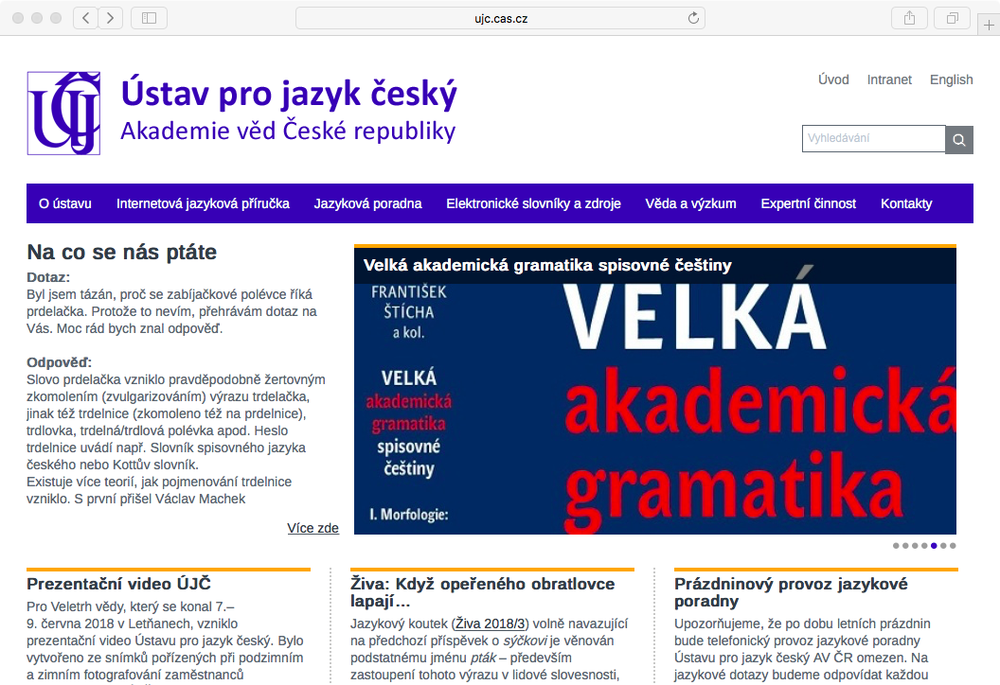
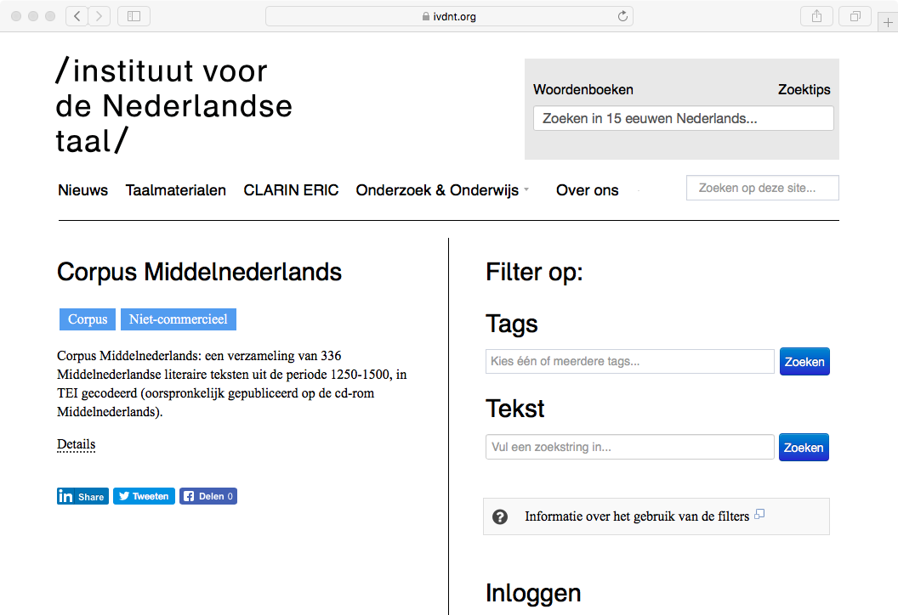
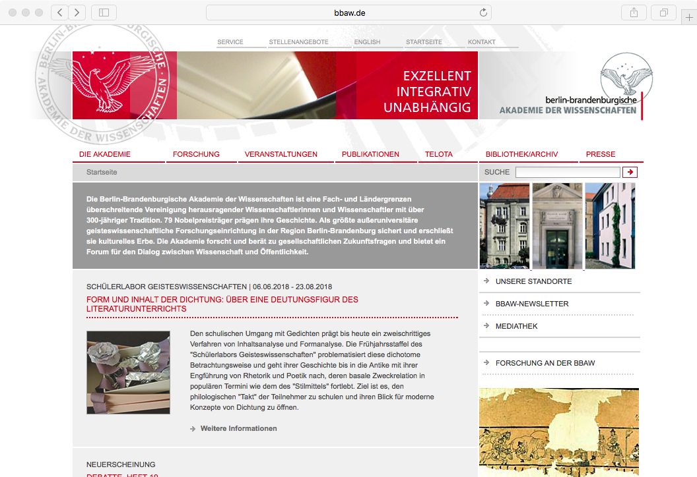
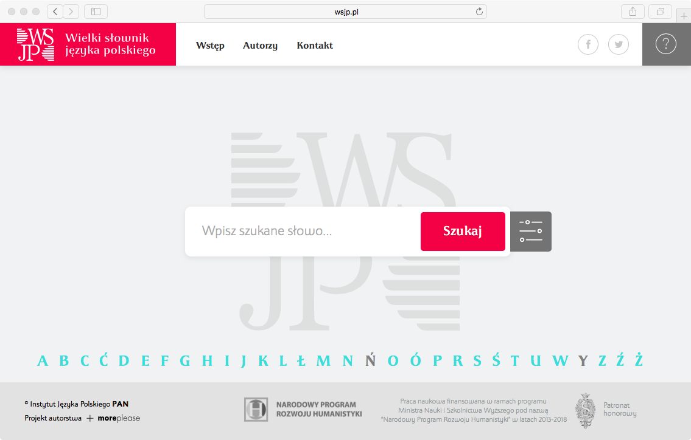

## { .white }

Problemy instytutów humanistycznych

 
Maciej Eder (Instytut Języka Polskiego PAN)

Będlewo, 14 VII 2018

## Wieloletnie prace zbiorowe

* Instytut Historii im. Tadeusza Manteuffla PAN
    * Polski słownik biograficzny
    * Słownik historyczno-geograficzny ziem polskich
    * Bibliografia historii polskiej

* Instytut Języka Polskiego PAN
    * Słownik polszczyzny XVI wieku
    * Polska bibliografia literacka

* Instytut Slawistyki PAN
    * Słownik prasłowiański

* etc. etc. etc.

## Wieloletnie prace zbiorowe

* Instytut Języka Polskiego PAN
    * Słownik staropolski
    * Wielki Słownik Języka Polskiego
    * Słownik polszczyzny XVII i XVIII wieku
    * Słownik łaciny średniowiecznej w Polsce
    * Słownik gwar polskich
    * Słownik gwar Mazur i Ostródzkiego
    * Słownik staropolskich nazw osobowych
    * Słownik pojęciowy języka staropolskiego
    * Ogólnosłowiański Atlas Językowy
    * Atlas Języków Europy

## 

<h2 class="shout">89%</h2>

## 

<h2 class="shout">Po co PAN-owi słowniki</h2>

## Thesaurus Linguae Latinae (1893!)

{width=800px}

## Staročeský slovník

{width=800px}

## Middelnederlands woordenboek

{width=800px}

## Svenska Akademiens ordbok

{width=800px}

## Trésor de la Langue Française

{width=800px}

## BBAW – 32 (!) słowniki i korpusy

{width=800px}

## Das Institut für Deutsche Sprache

{width=800px}

## 

<h2 class="shout">A ile za to dają punktów?</h2>

## SXVII: ofiara własnego sukcesu

{width=800px}

## WSJP: kamień młyński u szyi IJP PAN (?)

{width=800px}

## 

<h2 class="shout">Czy Polacy zasługują na słowniki?</h2>

## 

<h2 class="shout">89%</h2>

## Lingwistyka chemiczna

{.cover}

## Sukces czy strzał do cudzej tarczy?

{width=800px}

##

<h2 class="shout">15 punktów</h2>

## Powód do dumy?

Indogermanische Forschungen (IF 0.189)

Literary and Linguistic Computing (IF 0.460)

Digital Scholarship in the Humanities (IF 0.715)

R Journal (IF 1.55)

Scientific Reports (IF 4.609)

Mississippi Quarterly (0 kudryków)

## Wpisać chemię, czy może informatykę? DH?

Indogermanische Forschungen (IF 0.189)

Literary and Linguistic Computing (IF 0.460)

Digital Scholarship in the Humanities (IF 0.715)

R Journal (IF 1.55)

Scientific Reports (IF 4.609)

Mississippi Quarterly (0 kudryków)

## Humanistyka cyfrowa w instytutach PAN

{.cover}

##

