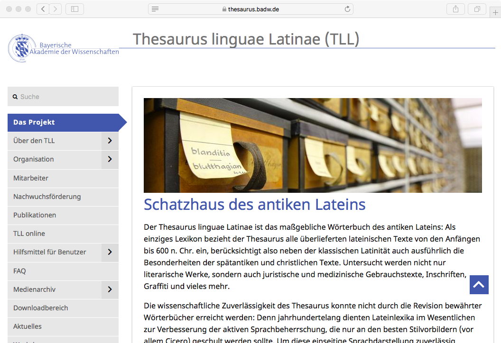
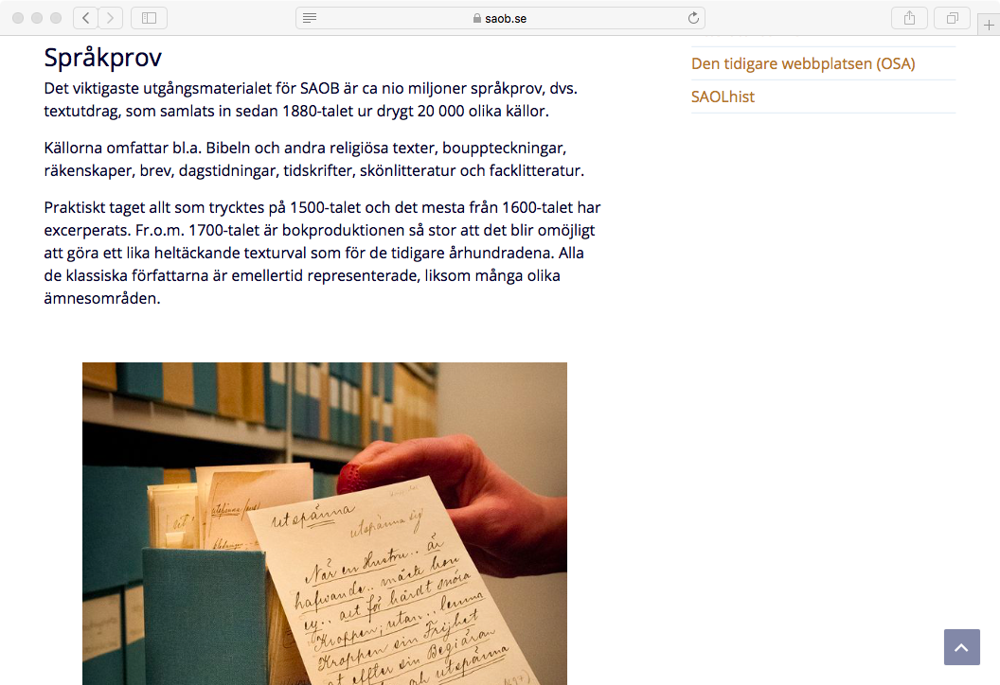

## { .white }

Managing Projects: Two Examples

 
Maciej Eder

(Instytut Języka Polskiego PAN)

<!-- 

Będlewo, 25th July 2018

 -->

## Chemical Linguistics

* 5-year project founded by National Centre for Science
* Three partners:
    * Institute of Organic Chemistry (Polish Academy of Science)
    * Institute of Mathematics (University of Warsaw)
    * Institute of Polish Language (Polish Academy of Sciences)

## 

{.cover}

## How to publish in ‘real’ (?) sciences

{width=800px}

## Issues to overcome

* Three different cultures of scientific thinking
* Different expectations when it comes to the main goals of the project
* Communication
    * two teams in Warsaw, one in Krakow
    * PI based in South Korea
    * regular Skype calls

## Risk management

* internal sources of risk
    * a team member leaving the team
    * troubled collaborators
    * conflicts in the team
    * delays, due to different reasons
    * everything turns our more complex than one assumed

* external sources of risk
    * the amount of work was bigger than estimated (e.g. new sources)
    * the research hypothesis was not confirmed

## 

<h2 class="shout">IJP PAN</h2>

## Institute of Polish Language

* 100 full time employees: 
    * 75 faculties
    * 25 non-faculty members (incl. post-docs)
* 25 PhD students

## Overview

* Areas of interest:
    * lexicography
    * linguistics
    * corpora
    * linguistic resources
* Mission:
    * documenting the Polish language in its historical, dialectal etc. variants
    * doing cutting edge scholarship in linguistics
    
    
    
    
    
    
## Constrains

* State founded: renewed on a 4-year basis
* Founds depend on the number of faculties (“N”)
* The faculties being evaluated by the Ministry

## Long term projects at the Academy

* Institute of History
    * Polski słownik biograficzny
    * Słownik historyczno-geograficzny ziem polskich
    * Bibliografia historii polskiej

* Institute of Literary Research
    * Słownik polszczyzny XVI wieku
    * Polska bibliografia literacka

* Institute of Slavistics
    * Słownik prasłowiański

* etc. etc. etc.

## Long term projects at the Academy

* Institute of the Polish Language
    * Słownik staropolski
    * Wielki Słownik Języka Polskiego
    * Słownik polszczyzny XVII i XVIII wieku
    * Słownik łaciny średniowiecznej w Polsce
    * Słownik gwar polskich
    * Słownik gwar Mazur i Ostródzkiego
    * Słownik staropolskich nazw osobowych
    * Słownik pojęciowy języka staropolskiego
    * Ogólnosłowiański Atlas Językowy
    * Atlas Języków Europy

## 

<h2 class="shout">89%</h2>

## 

<h2 class="shout">Why bother?</h2>

## Thesaurus Linguae Latinae (1893!)

{width=800px}

## Staročeský slovník

{width=800px}

## Middelnederlands woordenboek

{width=800px}

## Svenska Akademiens ordbok

{width=800px}

## Trésor de la Langue Française

{width=800px}

## BBAW – 32 (!) dictionaries and corpora

{width=800px}

## Das Institut für Deutsche Sprache

{width=800px}

## 

<h2 class="shout">Credit Points</h2>

## SXVII: a victim of its own success

{width=800px}

## WSJP: a troublemaker (?)

{width=800px}

## 

<h2 class="shout">89% _vs._ 11%</h2>

## Digital Humanities at the Institute

{.cover}

##

